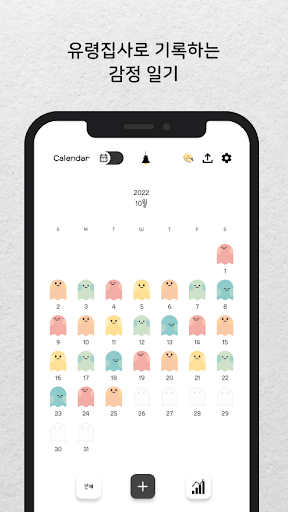
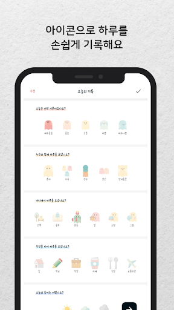
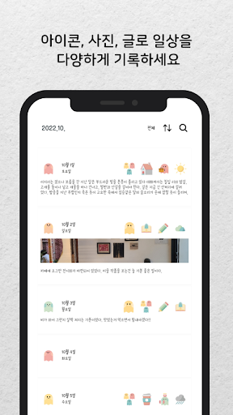
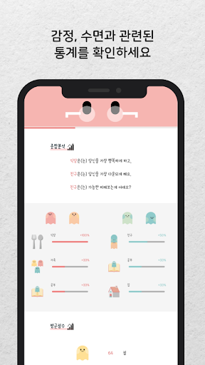
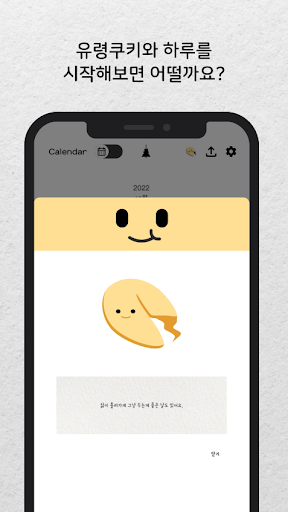
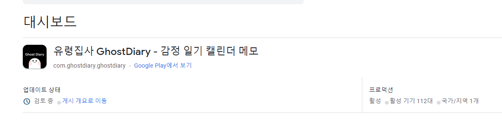

# GhostDiaryFE

## **프로젝트 개요**

소중한 하루를 유령집사와 함께 기록해보세요! GhostDiaryFE는 귀여운 유령집사 캐릭터로 일상을 쉽고 빠르게 기록할 수 있는 안드로이드 기반의 앱입니다. 감정 기록부터 일상 기록, 통계 확인, 메모 기능 등 다양한 기능을 제공하며, 사용자 친화적인 디자인으로 구성되어 있습니다.

## **주요 기능**

1. **감정 기록:** 유령집사 캐릭터로 기분을 기록하고, 달력에서 한눈에 확인해보세요. 일기를 각 감정별로 분류하는 것도 가능해요.
2. **일상 기록:** 다양한 아이콘으로 누구와 무엇을 하며 하루를 보냈는지 기록해보세요. 평소에는 아이콘으로 간단하게, 소중한 날에는 사진과 함께 긴 글로 기록해보세요.
3. **한눈에 보는 통계:** 기록한 감정과 수면시간에 대한 통계를 확인해보세요. 내 감정에 영향을 주는 요인들을 파악해보세요.
4. **메모:** 여행기록, 요리기록 등 테마를 나누어 기록하고 싶었던 적이 있나요? 폴더를 만들어 주제별로 차곡차곡 기록해보세요. 또는 꼭 기억해야 하지만 다이어리에 적기에는 애매한 내용들은 메모란에 따로 작성해보세요.
5. **포춘쿠키:** 하루의 시작을 유령쿠키와 함께해 보세요. 도움이 될 만한 쪽지가 들어있을 거에요. 혹시 감정에 대한 조언을 구하고 싶다면 유령쿠키를 다시 찾아와주세요.
6. **디자인 테마:** 유령집사는 다양한 테마의 캘린더를 제공해요. 현재 라이트테마, 다크테마, 할로윈테마를 제공하고 있어요.
7. **잠금 설정:** 비밀번호를 설정해 기록을 안전하게 보관할 수 있어요.
8. **기타 기능:** 알림 기능, 폰트 설정, 캘린더 이미지 공유 등의 기능도 제공하고 있어요.

## **개발 기간**

2022년 7월부터 2022년 10월까지

[개발 히스토리](개발히스토리.md)

## **개발 환경 및 사용 기술**

1. **프로그래밍 언어:** Kotlin
2. **개발 환경:** Android Studio
3. **데이터베이스:** SQLite
4. **버전 관리:** Git, Github
5. **배포:** Google Play Store

## **프로젝트 진행**

이 프로젝트에서 저는 개발을 맡았습니다.  기획 및 디자인은 다른 분이 담당하였으며, 저는 다음과 같은 작업을 수행했습니다:

1. 전체적인 앱 아키텍처를 설계하고 구현했습니다.
2. Kotlin을 사용하여 안드로이드 앱을 개발했습니다.
3. 내부 SQLite 데이터베이스를 사용하여 일기 데이터를 저장하고 관리하는 기능을 구현했습니다.
4. 앱을 Google Play Store에 배포했습니다.

## **Google Play Store 링크**

<s>[여기](https://play.google.com/store/apps/details?id=com.ghostdiary.ghostdiary)를 클릭하면 Google Play Store에서 GhostDiaryFE 앱을 다운로드받을 수 있습니다. </s>

[APK](17.apk)

## **스크린샷**

## **라이선스**

이 프로젝트는 [MIT 라이선스](https://chat.openai.com/c/LICENSE) 하에 라이선스가 부여됩니다.

## 일단)서비스 종료

홍보도 기획자분이 열심히 해주시고 친구가 도와줘서 많은 분들이 받아주고 리뷰도 좋게 써주셔서 첫 출시 치고는 나름 잘되었습니다. 

그래서 출시부터 한동안  리뷰에서 피드백을 받아 업데이트도 진행하였고  하지만 당장 해결 할 수 없는 피드백들이 있었는데

첫 번째로, 많은 사용자들이 'iOS에서도 이용하고 싶다'는 의견을 주셨습니다. 또한 디자인에 대한 칭찬을 받았습니다. 이러한 요구와 피드백을 반영하여 애플리케이션을 iOS에서도 사용할 수 있게 개선하려 합니다.

두 번째로, '백업 및 복구 기능이 있었으면 좋겠다'는 의견이 있었습니다. 내부 db로 구현된 것인 만큼 db파일만 올리면 될 줄 알았는데, 사진 데이터도 포함하고 있으니 문제가 있어서, 백엔드 구현을 고민했습니다.

세 번째로, 어디서든 일기를 볼 수 있고 궁극적으로는 웹에서도 저희 서비스를 이용하실 수 있게 하기 위해

위의 모든 개선 사항을 통합하기 위해,  Flutter를 사용하고 외부 서버를 추가하여 애플리케이션을 재개발할 계획입니다.
